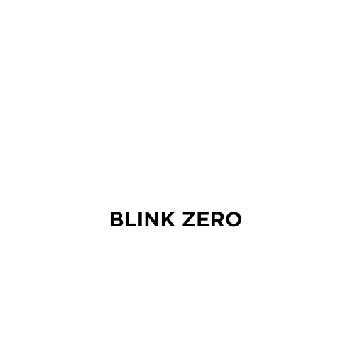

# blinkzero

    



A visual environment for designing, configuring, and deploying Solana Actions (Blinks) without writing code.

## Motivation

Creating Solana Actions currently requires manual coding, which limits adoption; This project aims to remove this barrier by enabling the visual construction and deployment of Blinks without engineering dependencies.

## Solution

**blinkzero** solves this by providing a visual abstraction layer over the Solana Actions specification. Instead of manually coding API endpoints, users define parameters through a GUI which the system compiles into valid Action payloads.

Unlike generic boilerplate templates, this architecture:

* **Abstracts Lifecycle Management:** Automatically handles the `GET` (metadata) and `POST` (transaction) request cycle required by the Actions spec, eliminating common configuration errors.
* **Enforces Safety Constraints:** Uses pre-validated transaction builders for common patterns (e.g., SPL transfers, NFT minting) to prevent the construction of malicious or malformed payloads.

> [!Note]
> Planned Feature: Hot-Swappable Configuration - Stores Blink definitions as structured data, allowing users to update metadata (labels, icons, descriptions) instantly without redeploying the underlying infrastructure.

## Stack

* **Frontend (Builder):** Next.js, React, TypeScript
* **Backend (API & TX Engine):** Rust (Axum/Tokio), Solana SDK
* **Database:** PostgreSQL
* **Infrastructure:** Vercel (Frontend), Docker (Backend)

## Local Development

The repository is structured as a monorepo. You must run the backend services before starting the frontend interface.

### 1. Backend Setup (Transaction Engine)

The Rust backend handles transaction serialization and interaction with the Solana RPC.

1. Navigate to the server directory:

    ```bash
    cd backend
    ```

2. Configure environment variables:

    Create a `.env` file with your RPC URL and Backend URL (optional).

3. Run the Rust server:

    ```bash
    cargo run
    ```

4. For a better development experience, use the following command with cargo watch: (bunyan is used to prettify the trace logs, can be installed with `cargo install bunyan`)

    ```bash
    cargo watch -x 'clippy --all-features --all-targets -- -D warnings' -x test -x run | bunyan
    ```

### 2. Frontend Setup (Visual Builder)

The Next.js application provides the UI for creating and managing Blinks.

1. Open a new terminal and navigate to the web directory:

    ```bash
    cd frontend
    ```

2. Install dependencies:

    ```bash
    npm install
    ```

3. Configure environment variables:

    Copy `.env.example` to `.env.local`. Ensure `NEXT_PUBLIC_API_URL` points to your running Rust backend (default: `http://localhost:8000`).

4. Run the development server:

    ```bash
    npm run dev
    ```

## Deployment

### Frontend (Vercel)

1. Push the code to your git repository.
2. Import the project into Vercel, setting the **Root Directory** to `apps/web`.
3. Add the environment variables defined in `.env.example`.
4. Deploy.

### Backend

The Rust backend requires a long-running server environment (e.g., VPS, Shuttle, or a Docker container). It cannot be deployed to Vercel Edge Functions due to the heavy compute requirements of the Rust Solana SDK.

## License

[MIT License](./LICENSE)
